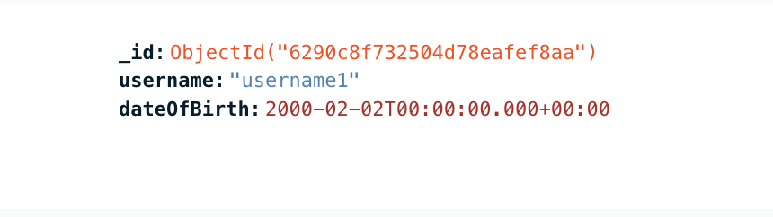

# This file contains demo of deployment to existing EKS cluster

1. Start with building project and running tests

2. Build Docker image

3. Push Docker image

4. Run helm deployment

5. Check if all resources are running

6. Check if API is responding (using port-forward)

7. Check if object exists in database

I hope you enjoyed this demo and whole project :)

