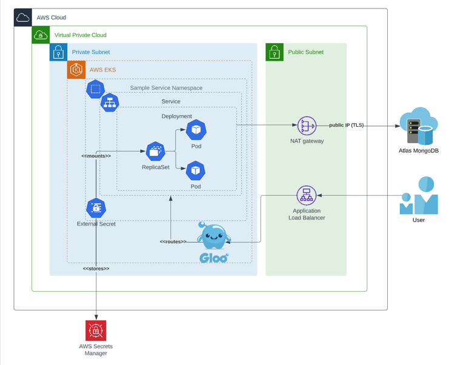

## Simple Service System Diagram 

Simple service is a service designed to be deployed on kubernetes environment. My proposal is to deploy it to the EKS - Elastic Kubernetes Service in AWS.

### Key Concepts

System architecture includes a few popular solutions, like:  

 - k8s deployment and service
 - k8s replica set
 - external secret (for storing db connection uri in AWS Secret Manager)
 - gloo for in-cluster routing
 - nat gateway for connecting with external db
 - ALB for load balancing
 - Atlas MongoDB for storing data (managed mongoDB deployment)

You can see my proposal for design below:

Note: For production environment I would propose VPC peering between atlas mongoDB cluster and EKS cluster. I don't think it is necessary in simple service case.

